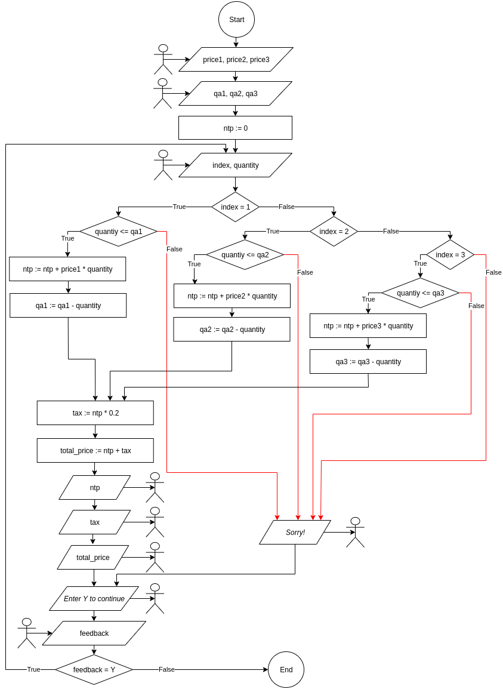

# Milestone 1: Basic Specifications / Algorithms Only
## 1.1
### First alternative (Product price is an input)

  

### Second alternative (Product price is a constant)

  

## 1.2

  

## 1.3

  

## 1.4

  

## 1.5

  

