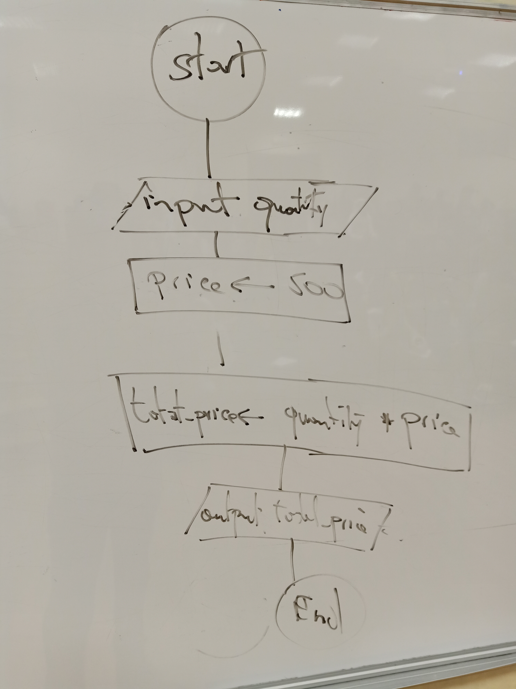

# 1.1
## First alternative (Product price is an input)

## Second alternative (Product price is a constant)

# 1.2
## First alternative (Output total price with tax)

## Second alternative (Output net total price, tax and total price with tax)

# 1.3

